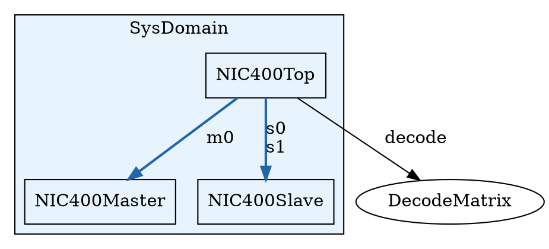

# `arch build --emit-diagram` — Module Hierarchy and Connectivity Topology Diagram

**Date:** 2026-06-05  
**Status:** Proposal — ready for discussion  
**Effort estimate:** ~300 LoC for v1 (DOT); ~+80 LoC for Mermaid variant; ~+120 LoC for TLM-edge v2

---

## Problem

As ARCH designs grow beyond a single module, understanding port connectivity requires reading every source file simultaneously. There is currently no way to get a visual overview of:

- Which modules instantiate which (the `inst` hierarchy)
- How bus ports are connected across instance boundaries (AXI, TLM initiator/target)
- Which modules share a clock domain vs. cross one
- Where TLM method call edges originate and terminate

This affects several concrete workflows today:

1. **NIC-400 code review** — 8+ modules with complex AXI routing; reviewers must mentally map connections across files or trace `inst` declarations by hand.
2. **E203 SoC** — 39 modules in a 6-level `inst` hierarchy; a new contributor has no entry point other than reading all 39 source files.
3. **LLM-assisted development** — when asking an LLM to write a connecting wrapper module or testbench harness, there is no compact representation to paste into the prompt to convey topology; the LLM must infer structure from a file listing.
4. **Documentation** — there is no way to auto-generate architecture diagrams from source; every published diagram is maintained by hand and drifts from the actual code.

The `--emit-thread-map` HTML sidecar (added in PR #483) proves the "auto-generated structural visualization" pattern works and has high value; this proposal extends it to the module-level.

---

## Proposed Solution

Add `--emit-diagram[=PATH]` to `arch build`:

```
arch build NIC400Top.arch NIC400Master.arch NIC400Slave.arch \
  --emit-diagram nic400.dot
```

Outputs a **Graphviz DOT file** (default) with an optional `--diagram-format mermaid` variant for GitHub rendering in Markdown.

---

## What Gets Rendered

### v1 — Module/inst hierarchy + bus ports + clock domains (~300 LoC)

**Module boxes:** One node per unique module name, labeled with module name and clock domain (derived from `Clock<Domain>` port declarations). Clock domains rendered as Graphviz `subgraph cluster_<domain>` with a consistent background color per domain.

**Inst edges:** A directed edge `ParentModule → ChildModule` for each `inst child: ChildModule` declaration, labeled with the instance name. `generate for` instances are shown as a single edge labeled `child[0..N-1]`.

**Bus-typed ports:** Ports with `bus_info: Some(...)` (initiator/target bus ports) are shown as a separate tier inside the module box, with bus type name and role (initiator/target). When an initiator port in one module connects to a target port of the same bus type in another, the edge is drawn with a distinct style (bold, colored by bus type) to distinguish it from raw data edges.

**Port connection labels:** Each inst edge can be annotated (opt-in via `--diagram-detail=connections`) with a summary of non-trivial port bindings (e.g. `clk→sys_clk, rst→sys_rst, data_in→pipeline_out`). Off by default to keep the default diagram readable.

**Example DOT skeleton:**



### v2 — TLM method call edges (~+120 LoC, post-v1)

TLM `thread` initiator call sites (e.g. `d <= m.read(addr)`) emit dashed arrows from the calling module to the target bus port's binding module, labeled with the method name and call mode (`blocking` / `out_of_order`). This makes the TLM call graph visible without reading thread bodies.

```dot
NIC400Master -> NIC400Slave [label="s_axi.read (blocking)" style=dashed color="#aa6622"];
```

---

## Implementation Approach

The implementation follows the exact pattern of `thread_map.rs` + `--emit-thread-map`.

### New file: `src/diagram.rs`

```rust
#[derive(Debug, Clone, Default)]
pub struct HierDiagram {
    pub nodes: Vec<DiagramModule>,
    pub edges: Vec<DiagramEdge>,
}

#[derive(Debug, Clone)]
pub struct DiagramModule {
    pub name: String,
    pub clock_domain: Option<String>,  // from Clock<Domain> port type param
    pub bus_ports: Vec<DiagramBusPort>,
    pub span: Span,
}

#[derive(Debug, Clone)]
pub struct DiagramBusPort {
    pub port_name: String,
    pub bus_type: String,
    pub role: BusRole,  // Initiator | Target
}

#[derive(Debug, Clone)]
pub struct DiagramEdge {
    pub parent: String,
    pub child: String,
    pub instance_names: Vec<String>,  // collapsed for generate-for
    pub bus_type: Option<String>,     // Some if a bus-typed connection
}

pub fn render_dot(diagram: &HierDiagram) -> String { /* ~150 LoC */ }
pub fn render_mermaid(diagram: &HierDiagram) -> String { /* ~80 LoC */ }
```

### Collection: hooked into `elaborate.rs`

`elaborate_module` already walks all `InstDecl` nodes and resolves `module_name`. The diagram collection is a second pass over the same elaborated AST nodes, extracting:
- Module names + clock domain from port list (walk `PortDecl` looking for `TypeExpr::Clock { domain }`)
- Bus ports from `port.bus_info: Some(BusPortInfo { bus_name, role })`
- Inst edges from `InstDecl { name, module_name, .. }`
- TLM edges (v2) from lowered thread call sites already tagged in `lower_threads`

### CLI wiring: `main.rs`

Mirror the `emit_thread_map` pattern exactly:

```rust
/// `<sv-output-stem>.dot`; `--emit-diagram=PATH` writes to PATH.
#[arg(long)]
emit_diagram: Option<Option<PathBuf>>,

/// Output format for --emit-diagram: `dot` (default) or `mermaid`.
#[arg(long, default_value = "dot")]
diagram_format: DiagramFormat,
```

In the `Command::Build` arm, after SV emission, collect the diagram and render/write the sidecar file — the same 10-line block used for the thread map.

---

## Alternatives Considered

**Option A: Extend `--emit-thread-map` HTML** — embed a module topology pane alongside the FSM states. Rejected: the thread map HTML is already complex; mixing FSM-level and module-level views in one file creates a cluttered UX. Separate sidecar files let each tool do one thing.

**Option B: Emit Mermaid only** — Mermaid is natively rendered by GitHub Markdown, making it useful for auto-generated `README.md` embeds. Rejected as the sole format: Mermaid has limited layout control for large hierarchies (NIC-400 would be unreadable); DOT + `dot -Tsvg` gives a proper hierarchical layout. Both formats should be supported.

**Option C: JSON output only** — let users render however they want. Rejected: removes 80% of the value. The JSON intermediate representation is trivially derivable from the DOT output.

---

## Data Availability Confirmation

All data needed for v1 is already present in the post-elaboration AST:

| Diagram element | AST source |
|---|---|
| Module names | `TopItem::Module { name, .. }` |
| `inst` edges | `ModuleBodyItem::Inst(InstDecl { name, module_name, .. })` |
| Clock domain | `PortDecl { ty: TypeExpr::Clock { domain }, .. }` |
| Bus ports | `PortDecl { bus_info: Some(BusPortInfo { bus_name, role }), .. }` |
| Generate-for count | `InstDecl::for_loops` (pre-elaboration) or elaborated `connections` range |

For v2, TLM call edges are tagged at lowering time in `lower_threads.rs` and already flow into `ThreadMapThread::hazards` — the same pass can populate `DiagramEdge::bus_type`.

---

## Test Plan

1. **Unit test** `render_dot()`/`render_mermaid()` on a hand-constructed `HierDiagram` with two modules + one edge + one clock domain cluster. Assert DOT parses cleanly with `dot -Tsvg /dev/stdin`.
2. **Integration test** `arch build NIC400Top.arch ... --emit-diagram nic400.dot`: assert the output file exists, contains `NIC400Top`, `NIC400Master`, `NIC400Slave`, and at least one `->` edge.
3. **Snapshot test** on a 3-module example (top + 2 submodules, two clock domains, one AXI bus connection): golden `.dot` file checked in, diff on change.
4. **No-op test**: single-module build with `--emit-diagram` produces a valid DOT with one node and zero edges.
5. **Mermaid test**: `--diagram-format mermaid` on the same 3-module example produces a `graph TD` block with correct node labels.

---

## Why This Matters

The ARCH language is explicitly designed to be generated by LLMs from natural-language hardware descriptions. The flip side is that LLMs also need to *understand* existing ARCH designs to generate connecting code (wrappers, adapters, testbench instantiation). Today that requires pasting all source files into the context. A compact, auto-generated topology diagram:

- Fits in ~50 lines of Mermaid for a 10-module design (vs. 500+ lines of source)
- Survives round-trips through LLM context compression without losing structural information
- Is the standard artifact that hardware architects share in design reviews, reducing friction for new contributors

It also directly helps with the cross-repo HARC/ARCH workflow: a HARC testbench author who wants to understand what buses and ports a design exposes can read a 20-node diagram rather than grepping across 10 `.arch` files.
